# Contents

1. [How do I get set up to run code locally?](#how-to-set-up-to-run-code-locally)
2. [Scan Descriptions](#scan-descriptions)
3. [Notes](#notes)
4. [Maps](#maps)
5. [Plots](#plots)
6. [ROI Measurements](#roi-measurements)

### How to set up to run code locally 

* Clone or download this repository to your local machine
* Download and extract input data zip files by either:
	+ At a command prompt, `cd ./code` and execute `./download_data_all.py` or
	+ Manually download and unzip the following files in the `./data_input` folder
		1. [VUMC_MRF_210_images.zip](https://github.com/welcheb/Hamburg_MRF_workshop_VUMC_results/releases/download/v0.1.0/VUMC_MRF_210_images.zip)
		2. [VUMC_MRF_500_images.zip](https://github.com/welcheb/Hamburg_MRF_workshop_VUMC_results/releases/download/v0.1.0/VUMC_MRF_500_images.zip)
		3. [VUMC_MRF_1000_images.zip](https://github.com/welcheb/Hamburg_MRF_workshop_VUMC_results/releases/download/v0.1.0/VUMC_MRF_1000_images.zip)
		4. [VUMC_MRF_DICT.zip](https://github.com/welcheb/Hamburg_MRF_workshop_VUMC_results/releases/download/v0.1.0/VUMC_MRF_DICT.zip)
* Open MATLAB, change to `./code` folder and run the m-file `batch_process.m`

### Scan Descriptions 
|  Scan Name  |  Scan Time mm:ss |  TI ms |  TR ms |  TE ms |  Max Flip Angle |  Repetition Delay ms  |  TFE Inversion Delay ms |  TFE Shot Interval ms | Dynamics |  Spiral Duration ms |  Spiral Interleaves |  Reconstructed  |
|---------------|------------|------------|------------|------------|------------|------------|------------|------------|------------|------------|------------|------------|
|  VUMC_MRF_1000_TE3.3_FSC | 10:14.0 | 20 | 16 | 3.3 | 70 |  N/A | 8012.00 | 26000 | 24 | 6.7578 |  24  |  YES |
|  VUMC_MRF_1000_TE3.3_US  | 00:16.0 | 20 | 16 | 3.3 | 70 |  N/A | 8012.00 | 26000 |  1 | 6.7578 |  24  |  YES |
|  VUMC_MRF_1000_TE5.0_FSC | 10:14.0 | 20 | 16 | 5.0 | 70 |  N/A | 8012.00 | 26000 | 24 | 6.7578 |  24  |  YES |
|  VUMC_MRF_1000_TE5.0_US  | 00:16.0 | 20 | 16 | 5.0 | 70 |  N/A | 8012.00 | 26000 |  1 | 6.7578 |  24  |  YES |
|  VUMC_MRF_210_TE3.3_FSC  | 03:04.8 | 28 | 28 | 3.3 | 70 | 1000 | 2953.96 |  6880 | 27 | 6.8843 |**27**|**NO**|
|  VUMC_MRF_210_TE3.3_US   | 00:26.6 | 28 | 28 | 3.3 | 70 | 1000 | 2953.96 |  6880 |  4 | 6.8288 |  24  |  YES |
|  VUMC_MRF_210_TE4.0_FSC  | 03:04.8 | 28 | 28 | 4.0 | 70 | 1000 | 2953.96 |  6880 | 27 | 6.8843 |**27**|**NO**|
|  VUMC_MRF_210_TE4.0_US   | 00:26.6 | 28 | 28 | 4.0 | 70 | 1000 | 2953.96 |  6880 |  4 | 6.8288 |  24  |  YES |
|  VUMC_MRF_500_TE3.3_FSC  | 07:01.5 | 15 | 15 | 3.3 | 60 |  N/A | 3757.49 | 18000 | 24 | 5.8876 |  24  |  YES | 
|  VUMC_MRF_500_TE3.3_US   | 00:07.5 | 15 | 15 | 3.3 | 60 |  N/A | 3757.49 | 18000 |  1 | 5.8876 |  24  |  YES |
|  VUMC_MRF_500_TE5.2_FSC  | 07:01.5 | 15 | 15 | 5.2 | 60 |  N/A | 3757.49 | 18000 | 24 | 5.8876 |  24  |  YES |
|  VUMC_MRF_500_TE5.2_US   | 00:07.5 | 15 | 15 | 5.2 | 60 |  N/A | 3757.49 | 18000 |  1 | 5.8876 |  24  |  YES |

### Notes 
* US stands for "undersampled", i.e., a single spiral interleaf per readout of the fingerprint pattern.
* FSC stands for "fully sampled center", i.e., 24 spiral interleaves avaialble per readout of the fingerprint pattern.
* Spirals are variable density with the change to x2 additional undersampling (24 to 48 interleaves) at 60% from k-space center.
* Dynamics are used for two purposes in the above scans.
	1. Repeated dynamics achieved the short relaxation time interval feature (length 210 pattern) by using the first 3 dynamics as the "dummy" repetitions.
	2. Repeated dynamics collected additional interleaves to fully sample the spiral trajectory.
* Spirals are rotated by the [Golden Angle](https://en.wikipedia.org/wiki/Golden_angle), which is 180 * (3 - sqrt(5)) = 137.50776405 degrees (full projection radial MRI golden angle is 111.246117975 degrees)	
* FSC 210 scans had an incorrect setting of 27 spiral interleaves and therefore have a mismatch between acquired and trajectory-measured spiral. Reconstructions will be completed in the near future.
* Excitation RF was selected to have a higher time-bandwidth product (RFex rf_shape = sg_500_200_0).
* No off-resonance correction is applied in current reconstructions. A single delta B0 fieldmap was acquired at the end of the scan session and appears to not agree with most scans. Center frequency was selected once at the beginning of the scan session with "selective F0" and likely drifted over the long scan session duration.
* Alternating RF phase in length 1000 pattern is removed during corrections applied to raw k-space data and the alternating phase is added back into the even numbered complex images before matching to the dictionary.
* ROI measurements use a circular shape with radius of 7 pixels yielding 149 samples in each ROI.
* [Concordance Correlation Coefficient](https://en.wikipedia.org/wiki/Concordance_correlation_coefficient) values are reported on the plots showing measured versus true T1 and T2 values.

### Maps 
Full size map images visible at this link: [Maps](./png/maps.md)
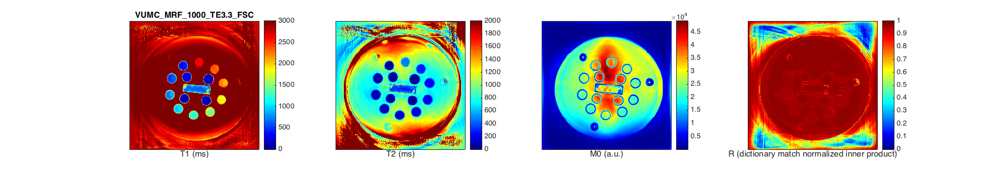
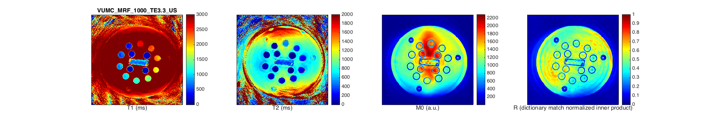
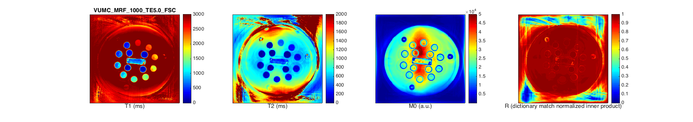
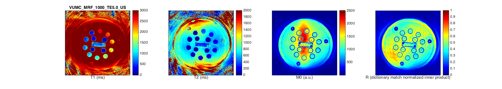
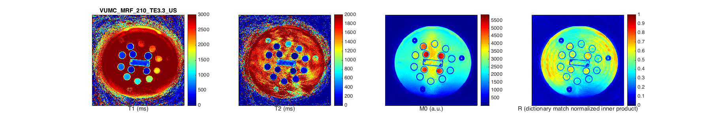
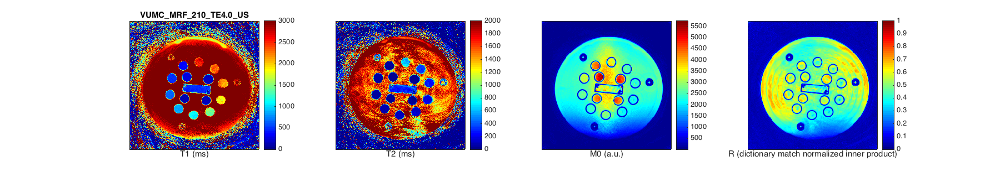
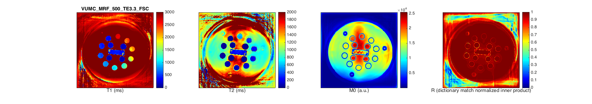
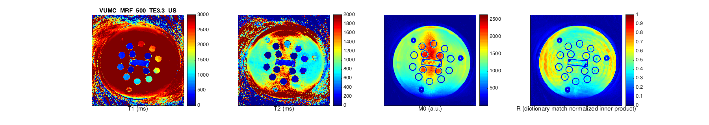
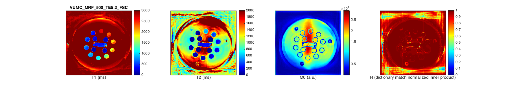
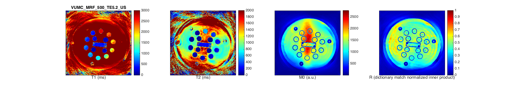

### Plots 
Full size plot images visible at this link: [Plots](./png/plots.md)
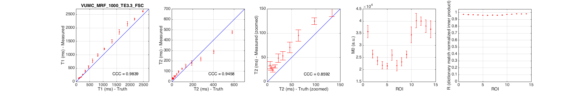
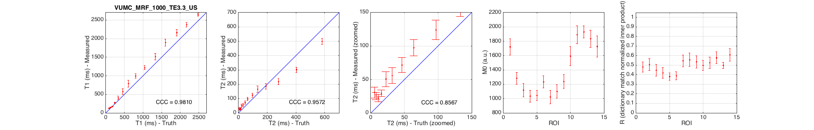

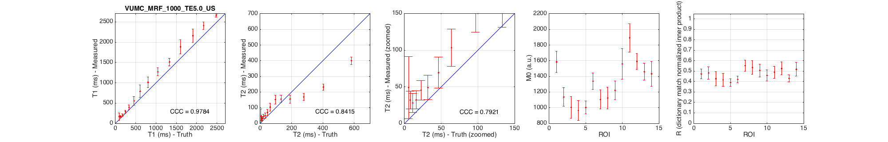
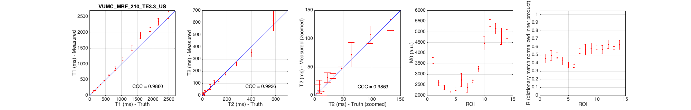
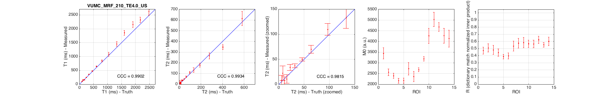
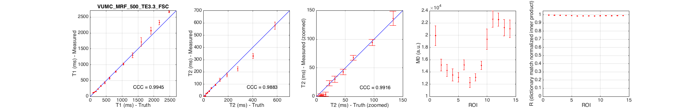
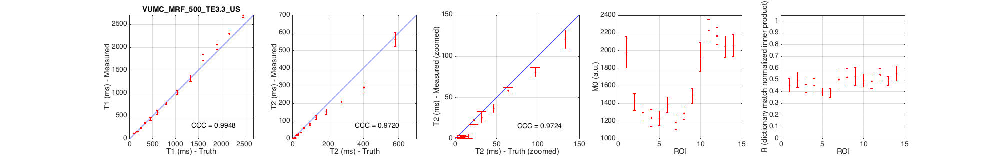
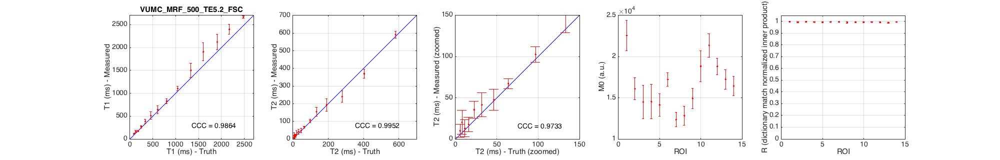
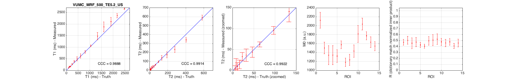

### ROI Measurements 

#### T1 mean
|  source_name  |  ROI_01  |  ROI_02  |  ROI_03  |  ROI_04  |  ROI_05  |  ROI_06  |  ROI_07  |  ROI_08  |  ROI_09  |  ROI_10  |  ROI_11  |  ROI_12  |  ROI_13  |  ROI_14  |
|---------------|------------|------------|------------|------------|------------|------------|------------|------------|------------|------------|------------|------------|------------|------------|
|  TRUTH  |  2480.0000  |  2173.0000  |  1907.0000  |  1604.0000  |  1332.0000  |  1044.0000  |  801.7000  |  608.6000  |  458.4000  |  336.5000  |  244.2000  |  176.6000  |  126.9000  |  90.9000  |
|  VUMC_MRF_1000_TE3.3_FSC  |  2620.9396  |  2329.6644  |  2152.3490  |  1849.7987  |  1503.7584  |  1219.3289  |  988.3893  |  776.3758  |  547.1141  |  396.3758  |  272.4161  |  173.4228  |  147.3826  |  126.0403  |
|  VUMC_MRF_1000_TE3.3_US  |  2642.9530  |  2372.0805  |  2157.9866  |  1891.5436  |  1514.4966  |  1214.8993  |  993.2215  |  786.0403  |  572.4832  |  404.0268  |  272.5503  |  172.2819  |  145.8389  |  123.9597  |
|  VUMC_MRF_1000_TE5.0_FSC  |  2650.7383  |  2380.1342  |  2166.8456  |  1883.3557  |  1526.1745  |  1305.7718  |  1041.0738  |  824.7651  |  559.7987  |  404.1611  |  295.5034  |  204.0940  |  175.0336  |  188.6577  |
|  VUMC_MRF_1000_TE5.0_US  |  2661.2081  |  2405.1007  |  2160.9396  |  1885.3691  |  1512.4832  |  1269.9329  |  1011.6107  |  789.7315  |  554.1611  |  393.4228  |  288.0537  |  200.4698  |  167.5839  |  165.0738  |
|  VUMC_MRF_210_TE3.3_US  |  2657.9866  |  2339.5973  |  2172.2148  |  1912.8859  |  1513.0201  |  1126.0403  |  867.2483  |  640.4698  |  473.5570  |  352.4161  |  249.7315  |  164.2953  |  145.7047  |  103.1409  |
|  VUMC_MRF_210_TE4.0_US  |  2623.6242  |  2321.0738  |  2152.8859  |  1853.6913  |  1452.3490  |  1080.9396  |  844.4966  |  641.5436  |  476.5772  |  357.1812  |  249.5973  |  162.4832  |  149.1946  |  102.6846  |
|  VUMC_MRF_500_TE3.3_FSC  |  2664.4295  |  2330.2013  |  2071.5436  |  1715.7047  |  1295.0336  |  1022.0134  |  780.0000  |  574.4295  |  429.2617  |  328.1208  |  232.4161  |  155.0336  |  133.4899  |  114.0268  |
|  VUMC_MRF_500_TE3.3_US  |  2693.4228  |  2290.4698  |  2057.5839  |  1706.9799  |  1326.0403  |  1006.0403  |  773.2886  |  574.1611  |  433.0872  |  338.1879  |  236.3087  |  156.9128  |  136.7785  |  115.0336  |
|  VUMC_MRF_500_TE5.2_FSC  |  2666.5772  |  2397.8523  |  2119.1946  |  1905.3691  |  1500.8054  |  1104.2953  |  824.0268  |  639.9329  |  512.8859  |  383.8255  |  267.3154  |  174.6980  |  161.3423  |  113.6913  |
|  VUMC_MRF_500_TE5.2_US  |  2672.7517  |  2364.0268  |  2105.6376  |  1876.3758  |  1479.3289  |  1059.0604  |  799.1946  |  620.4698  |  497.9195  |  383.5570  |  263.0872  |  169.5302  |  156.1074  |  108.8188  |

#### T2 mean
|  source_name  |  ROI_01  |  ROI_02  |  ROI_03  |  ROI_04  |  ROI_05  |  ROI_06  |  ROI_07  |  ROI_08  |  ROI_09  |  ROI_10  |  ROI_11  |  ROI_12  |  ROI_13  |  ROI_14  |
|---------------|------------|------------|------------|------------|------------|------------|------------|------------|------------|------------|------------|------------|------------|------------|
|  TRUTH  |  581.3000  |  403.5000  |  278.1000  |  190.9400  |  133.2700  |  96.8900  |  64.0700  |  46.4200  |  31.9700  |  22.5600  |  15.8130  |  11.2370  |  7.9110  |  5.5920  |
|  VUMC_MRF_1000_TE3.3_FSC  |  477.5839  |  288.7248  |  218.9262  |  179.7181  |  151.2752  |  124.9664  |  95.4228  |  70.9530  |  53.3154  |  48.6577  |  31.5570  |  24.6711  |  28.2953  |  34.1879  |
|  VUMC_MRF_1000_TE3.3_US  |  498.7248  |  301.4094  |  217.8792  |  186.1342  |  165.6107  |  123.7718  |  97.2081  |  71.6510  |  55.9463  |  50.7651  |  29.6644  |  22.4966  |  25.4094  |  30.6711  |
|  VUMC_MRF_1000_TE5.0_FSC  |  419.2617  |  244.0268  |  177.0201  |  162.3490  |  162.1074  |  163.6107  |  112.0403  |  74.4295  |  51.1007  |  49.8121  |  36.3490  |  32.0671  |  37.5302  |  60.3087  |
|  VUMC_MRF_1000_TE5.0_US  |  400.0000  |  231.6779  |  168.3758  |  155.0336  |  154.8591  |  151.8389  |  103.4362  |  69.4765  |  49.1544  |  45.4765  |  32.1477  |  28.2282  |  32.0268  |  49.2215  |
|  VUMC_MRF_210_TE3.3_US  |  618.9262  |  352.0805  |  260.8054  |  176.1342  |  134.1074  |  107.1544  |  72.0000  |  47.7852  |  34.8322  |  32.1477  |  7.0201  |  3.8523  |  15.8255  |  8.5772  |
|  VUMC_MRF_210_TE4.0_US  |  614.1611  |  347.3826  |  265.7047  |  177.7584  |  132.7919  |  109.6242  |  70.0268  |  50.0805  |  37.1275  |  34.0671  |  10.8322  |  7.4899  |  22.2819  |  8.3356  |
|  VUMC_MRF_500_TE3.3_FSC  |  577.7181  |  329.9329  |  225.5705  |  175.0336  |  136.4295  |  94.2550  |  67.7450  |  42.9396  |  30.3356  |  23.2886  |  4.2013  |  2.3490  |  2.7651  |  2.0000  |
|  VUMC_MRF_500_TE3.3_US  |  562.8859  |  290.2685  |  208.3624  |  154.3758  |  120.4698  |  80.8054  |  58.3758  |  37.0336  |  26.0671  |  22.7383  |  3.0336  |  2.0671  |  2.3490  |  2.0403  |
|  VUMC_MRF_500_TE5.2_FSC  |  591.4094  |  369.8658  |  240.4027  |  193.1544  |  154.9396  |  102.5369  |  67.2886  |  47.6644  |  41.6779  |  35.7315  |  17.8658  |  13.1409  |  20.4698  |  10.1745  |
|  VUMC_MRF_500_TE5.2_US  |  590.7383  |  341.6107  |  233.1141  |  174.5369  |  140.8725  |  95.8658  |  62.3356  |  43.7584  |  36.6711  |  33.0470  |  14.5235  |  9.5973  |  15.3826  |  4.8456  |

#### T1 sigma
|  source_name  |  ROI_01  |  ROI_02  |  ROI_03  |  ROI_04  |  ROI_05  |  ROI_06  |  ROI_07  |  ROI_08  |  ROI_09  |  ROI_10  |  ROI_11  |  ROI_12  |  ROI_13  |  ROI_14  |
|---------------|------------|------------|------------|------------|------------|------------|------------|------------|------------|------------|------------|------------|------------|------------|
|  TRUTH  |  0.0000  |  0.0000  |  0.0000  |  0.0000  |  0.0000  |  0.0000  |  0.0000  |  0.0000  |  0.0000  |  0.0000  |  0.0000  |  0.0000  |  0.0000  |  0.0000  |
|  VUMC_MRF_1000_TE3.3_FSC  |  23.0552  |  35.9131  |  78.4856  |  89.0678  |  69.9177  |  31.2285  |  52.2089  |  73.5969  |  50.2870  |  38.9423  |  10.4397  |  9.6403  |  8.4146  |  11.9016  |
|  VUMC_MRF_1000_TE3.3_US  |  39.2067  |  55.5473  |  91.1709  |  94.7880  |  90.1608  |  54.0847  |  58.4631  |  92.1575  |  73.1336  |  51.3325  |  15.3849  |  11.3376  |  7.7198  |  12.0707  |
|  VUMC_MRF_1000_TE5.0_FSC  |  32.7582  |  67.9625  |  136.7731  |  156.2639  |  77.9084  |  77.6790  |  132.5434  |  154.8913  |  102.2944  |  53.6518  |  32.3084  |  25.0409  |  24.1791  |  113.2306  |
|  VUMC_MRF_1000_TE5.0_US  |  39.3342  |  87.7698  |  162.3366  |  171.3008  |  92.9538  |  99.3118  |  132.2726  |  152.0844  |  109.1620  |  56.6016  |  38.3032  |  34.6281  |  25.0311  |  91.8964  |
|  VUMC_MRF_210_TE3.3_US  |  200.1316  |  109.5068  |  135.7404  |  107.1769  |  89.0468  |  90.2760  |  69.7569  |  20.3462  |  13.5604  |  15.7536  |  11.5048  |  10.4787  |  12.1508  |  8.1812  |
|  VUMC_MRF_210_TE4.0_US  |  135.6477  |  96.0795  |  102.8795  |  85.5218  |  83.6853  |  68.6486  |  38.3165  |  17.6193  |  13.5453  |  13.6600  |  11.1428  |  9.9936  |  15.4446  |  7.2588  |
|  VUMC_MRF_500_TE3.3_FSC  |  27.3956  |  68.5217  |  112.6147  |  137.9691  |  81.4366  |  32.3616  |  21.4350  |  36.3984  |  32.6342  |  18.5767  |  5.1532  |  5.1497  |  6.0321  |  4.9209  |
|  VUMC_MRF_500_TE3.3_US  |  43.5234  |  85.9159  |  104.9044  |  137.5053  |  71.6864  |  44.0948  |  24.9172  |  42.2365  |  36.5746  |  19.7297  |  7.4751  |  5.8007  |  6.5004  |  5.1497  |
|  VUMC_MRF_500_TE5.2_FSC  |  26.9577  |  111.6738  |  168.9535  |  199.0739  |  157.1517  |  47.5090  |  54.7095  |  91.7141  |  84.1836  |  46.7830  |  27.5492  |  18.6923  |  28.1564  |  8.9555  |
|  VUMC_MRF_500_TE5.2_US  |  38.9188  |  93.7789  |  184.3628  |  212.1582  |  157.5388  |  39.8535  |  59.3947  |  92.4906  |  84.0951  |  43.8837  |  32.5887  |  19.4289  |  25.4344  |  9.6002  |

#### T2 sigma
|  source_name  |  ROI_01  |  ROI_02  |  ROI_03  |  ROI_04  |  ROI_05  |  ROI_06  |  ROI_07  |  ROI_08  |  ROI_09  |  ROI_10  |  ROI_11  |  ROI_12  |  ROI_13  |  ROI_14  |
|---------------|------------|------------|------------|------------|------------|------------|------------|------------|------------|------------|------------|------------|------------|------------|
|  TRUTH  |  0.0000  |  0.0000  |  0.0000  |  0.0000  |  0.0000  |  0.0000  |  0.0000  |  0.0000  |  0.0000  |  0.0000  |  0.0000  |  0.0000  |  0.0000  |  0.0000  |
|  VUMC_MRF_1000_TE3.3_FSC  |  14.3626  |  16.9374  |  17.8636  |  21.7418  |  16.8863  |  7.1494  |  11.6603  |  10.8368  |  8.8157  |  8.5280  |  3.3194  |  4.5477  |  4.4744  |  7.6382  |
|  VUMC_MRF_1000_TE3.3_US  |  21.9732  |  18.5276  |  20.6165  |  19.7206  |  21.8603  |  14.4569  |  12.1518  |  11.4390  |  11.9706  |  11.1733  |  4.8791  |  5.3822  |  5.1753  |  8.1460  |
|  VUMC_MRF_1000_TE5.0_FSC  |  19.1401  |  15.5059  |  19.4500  |  23.0999  |  19.6672  |  24.3351  |  27.4270  |  21.2940  |  15.6472  |  13.5074  |  10.9858  |  10.0658  |  10.9060  |  48.9753  |
|  VUMC_MRF_1000_TE5.0_US  |  24.7692  |  19.1510  |  22.9763  |  24.7448  |  23.6988  |  27.2927  |  25.4474  |  21.0307  |  16.6135  |  13.3181  |  12.4382  |  12.9688  |  12.2386  |  42.3644  |
|  VUMC_MRF_210_TE3.3_US  |  84.6147  |  32.5758  |  17.1053  |  16.0264  |  19.1435  |  15.4661  |  21.4665  |  4.2116  |  4.7254  |  8.3151  |  6.8915  |  4.0543  |  11.3469  |  10.6550  |
|  VUMC_MRF_210_TE4.0_US  |  66.9520  |  22.3726  |  27.8571  |  18.8893  |  20.7323  |  11.7895  |  8.0101  |  3.4081  |  3.7150  |  6.0957  |  8.3572  |  7.5414  |  14.3791  |  9.8101  |
|  VUMC_MRF_500_TE3.3_FSC  |  30.2718  |  20.1513  |  16.1656  |  15.8329  |  12.3213  |  5.3184  |  4.3265  |  5.0967  |  5.6444  |  4.6503  |  3.6447  |  1.3898  |  2.2613  |  0.0000  |
|  VUMC_MRF_500_TE3.3_US  |  40.0725  |  26.4561  |  16.5383  |  15.6090  |  11.3528  |  5.5843  |  4.1353  |  5.5973  |  6.9881  |  5.1378  |  2.7273  |  0.8192  |  1.7357  |  0.4915  |
|  VUMC_MRF_500_TE5.2_FSC  |  20.0344  |  24.8777  |  33.5084  |  35.8715  |  26.1880  |  9.4658  |  6.0228  |  12.7288  |  14.5715  |  10.4485  |  8.8430  |  10.1934  |  14.5349  |  7.7701  |
|  VUMC_MRF_500_TE5.2_US  |  29.5483  |  26.3569  |  34.4308  |  34.8849  |  25.0333  |  9.4459  |  6.0333  |  12.5825  |  14.8699  |  9.9338  |  10.0065  |  9.4525  |  13.0258  |  6.4690  |