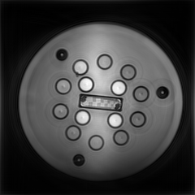
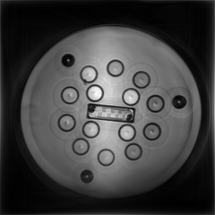
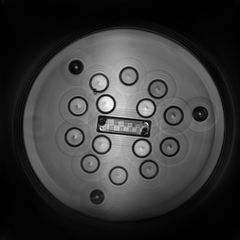
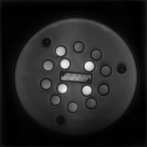
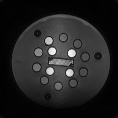
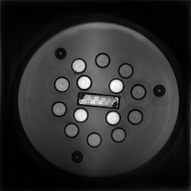
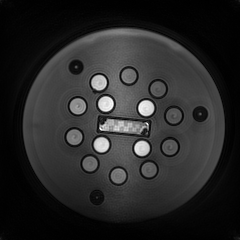
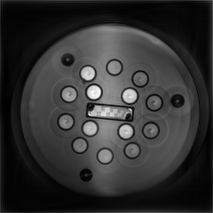
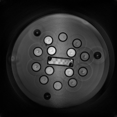

### Magnitude images after complex sum across all MR Fingerprinting frames

#### VUMC_MRF_1000_TE3.3_FSC

#### VUMC_MRF_1000_TE3.3_US

#### VUMC_MRF_1000_TE5.0_FSC

#### VUMC_MRF_1000_TE5.0_US

#### VUMC_MRF_210_TE3.3_FSC

#### VUMC_MRF_210_TE3.3_US

#### VUMC_MRF_210_TE4.0_FSC

#### VUMC_MRF_210_TE4.0_US

#### VUMC_MRF_500_TE3.3_FSC

#### VUMC_MRF_500_TE3.3_US

#### VUMC_MRF_500_TE5.2_FSC

#### VUMC_MRF_500_TE5.2_US

